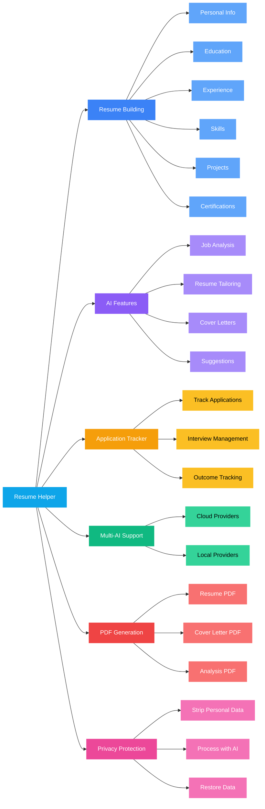
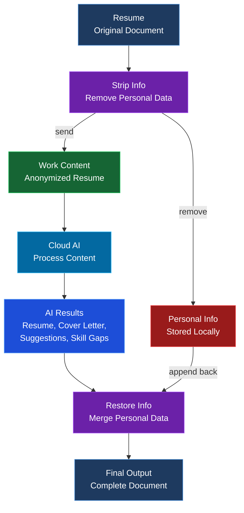

<div align="center">
  
  

  
  **AI-powered resume builder with multi-provider LLM support**
  
  [](LICENSE)
  [](https://www.python.org/downloads/)
  [](https://github.com/gibbenergy/Resume_Helper/actions/workflows/code-quality.yml)
  
  [Usage Guide](USAGE_GUIDE.md) | [License](LICENSE)
  
</div>

## App Demo

### AI Resume Helper

https://github.com/user-attachments/assets/857c7162-8baa-4eda-854a-9f30fff3caf0

### Application Tracking System

https://github.com/user-attachments/assets/ea617f6f-fb20-44fa-9bba-d45a1c36756d

---

## Features



### Privacy-Preserving Workflow

<div align="center">



**Before sending anything to AI, remove personal information. After getting the AI response, put it back.**

</div>

## Quick Start (Windows)

```bash
start_react_ui.bat
```

Or manually:
```bash
python -m venv .venv
.venv\Scripts\activate
pip install -r requirements.txt
playwright install chromium
cd backend
uvicorn backend.api.main:app --host 0.0.0.0 --port 5000
```

In another terminal:
```bash
cd frontend
npm install
npm run dev
```

Access at: `http://localhost:5173`

## Configuration

API keys are configured directly in the app:
1. Launch the app
2. Go to "AI Resume Helper" tab
3. Expand "AI Configuration" 
4. Select provider, enter API key, click "Set"

Keys are auto-saved and remembered for next session.

## Supported AI Models

**Recommended: Local Models (Free)**

**Ollama** - Easiest local setup
- **gpt-oss** - OpenAI's open-weight model (14GB, 128K context) - best for reasoning
- Qwen2.5, Llama 3.3, DeepSeek-R1 - smaller alternatives

**llama.cpp** - High-performance C++ inference
- Run any GGUF model with OpenAI-compatible API
- Lower memory usage, faster inference
- Default: `http://localhost:8080/v1`

**LM Studio** - User-friendly GUI
- Easy model downloads and management
- Built-in OpenAI-compatible server
- Default: `http://localhost:1234/v1`

**Lemonade** - Advanced LLM router/proxy
- Route requests to multiple local backends
- Smart model selection and load balancing
- OpenAI-compatible API with extended features
- Default: `http://localhost:8000/v1`
- **Recommended:** Use `--ctx-size 8192` or higher for job analysis

**Cloud Providers (API key required)**
- **OpenAI**: GPT-4.1, GPT-5, GPT-5-mini
- **Anthropic**: Claude Opus 4, Claude 3.5 Sonnet
- **Google**: Gemini 2.5 Pro, Gemini 2.5 Flash
- **Groq**: Llama 3.3
- **Perplexity**: Sonar Pro, Sonar Reasoning
- **xAI**: Grok 4, Grok 3

## Requirements

- Windows 10/11
- Python 3.11+
- Node.js 18+ (for frontend)
- For Ollama: ~14GB disk space for gpt-oss model

## License

Business Source License 1.1 - See LICENSE file
Free for personal/educational use. Commercial use requires a license.
