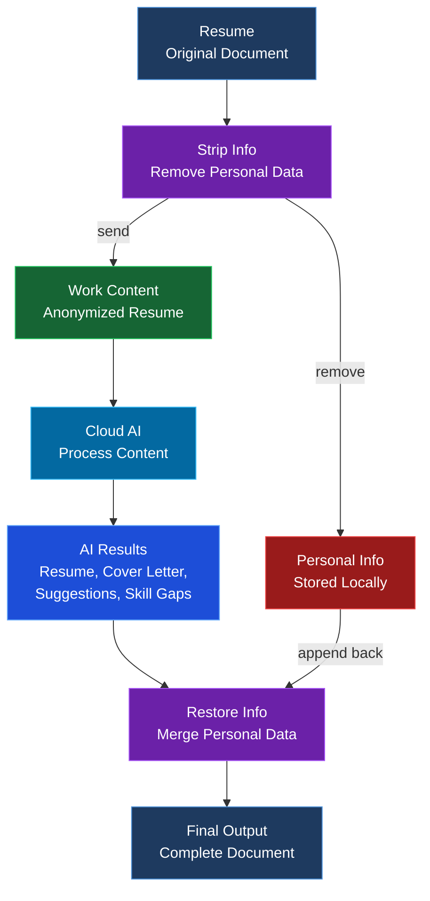

<div align="center">
  
  

  
  **AI-powered resume builder with multi-provider LLM support**
  
  [](LICENSE)
  [](https://www.python.org/downloads/)
  [](https://github.com/gibbenergy/Resume_Helper/actions/workflows/code-quality.yml)
  
  [Usage Guide](USAGE_GUIDE.md) | [License](LICENSE)
  
</div>

## App Demo

### AI Resume Helper

https://github.com/user-attachments/assets/857c7162-8baa-4eda-854a-9f30fff3caf0

### Application Tracking System

https://github.com/user-attachments/assets/ea617f6f-fb20-44fa-9bba-d45a1c36756d

---

## Features

| Category | Features |
|----------|----------|
| **Resume Building** | Personal Info, Education, Experience, Skills, Projects, Certifications |
| **AI Features** | Job Analysis, Resume Tailoring, Cover Letters, Suggestions |
| **Application Tracker** | Track Applications, Interview Management, Outcome Tracking |
| **Multi-AI Support** | Cloud Providers (OpenAI, Anthropic, Google, Groq, xAI, Perplexity) + Local (Ollama, llama.cpp, LM Studio, Lemonade) |
| **PDF Generation** | Resume PDF, Cover Letter PDF, Analysis PDF |
| **Privacy Protection** | Strip Personal Data before AI, Restore after processing |

### Privacy-Preserving Workflow

<div align="center">



</div>

## Supported AI Providers

<div align="center">

**Cloud Providers**

[](https://openai.com)
[](https://anthropic.com)
[](https://ai.google.dev)
[](https://perplexity.ai)
[](https://x.ai)
[](https://groq.com)

**Local Providers**

[](https://ollama.com)
[](https://github.com/ggml-org/llama.cpp)
[](https://lmstudio.ai)
[](https://github.com/lemonade-sdk/lemonade)

</div>

## Quick Start (Windows)

```bash
start_react_ui.bat
```

Access at: `http://localhost:5173`

For manual setup, see [Usage Guide](USAGE_GUIDE.md).

## Requirements

- Windows 10/11
- Python 3.11+
- Node.js 18+

## License

Business Source License 1.1 - See LICENSE file
