<div align="center">
  

# Resume Helper

**AI-powered resume builder with multi-provider LLM support**

[](LICENSE)
[](https://www.python.org/downloads/)
[](https://github.com/gibbenergy/Resume_Helper/actions/workflows/code-quality.yml)
[]()

[Usage Guide](USAGE_GUIDE.md) | [Changelog](CHANGELOG.md) | [License](LICENSE)

</div>

---

## Why Resume Helper?

**Privacy-first. Local-first. Free forever.**

Resume Helper is an open-source AI resume builder designed for job seekers who value their privacy and want complete control over their data. Unlike cloud-based resume services that charge monthly subscriptions and store your personal information on their servers, Resume Helper runs entirely on your machine.

### Privacy by Design

Your personal information never leaves your computer unless you explicitly choose to use cloud AI providers. When using external APIs, Resume Helper automatically strips personally identifiable information from requests. For maximum privacy, run entirely offline with local LLM providers like Ollama, llama.cpp, LM Studio, or Lemonade.

### Complete Job Application Automation

Stop switching between dozens of tabs and tools. Resume Helper handles your entire job search workflow:

- **Job Analysis** - Paste any job description and get instant analysis: required skills, experience level, company culture signals, and potential red flags
- **Salary Estimation** - AI-powered salary range predictions based on role, location, and requirements
- **Match Scoring** - See how well your resume matches each job with detailed skill gap analysis
- **Resume Tailoring** - Generate customized resume versions optimized for specific job postings
- **Cover Letter Generation** - Create targeted cover letters that highlight relevant experience
- **Application Tracking** - Manage all your applications, interviews, notes, and documents in one place

### Free and Open Source

Download once, use forever. No subscriptions. No usage limits. No accounts required. Your data stays on your machine in a local SQLite database that you own and control.

---

## App Demo

### AI Resume Helper

https://github.com/user-attachments/assets/857c7162-8baa-4eda-854a-9f30fff3caf0

### Application Tracking System

https://github.com/user-attachments/assets/ea617f6f-fb20-44fa-9bba-d45a1c36756d

---

## Features

<div align="center">
  
</div>

### Core Capabilities

| Feature | Description |
|---------|-------------|
| Resume Builder | Multi-section form with drag-to-reorder, import/export profiles |
| AI Analysis | Job description parsing, skill extraction, match scoring |
| Resume Tailoring | AI-generated resume customization for specific jobs |
| Cover Letters | Context-aware cover letter generation |
| Application Tracker | Status tracking, interview pipeline, document management |
| PDF/DOCX Export | Professional document generation via Playwright |
| Cost Tracking | Monitor API usage costs across all providers |
| Profile Management | Save multiple resume versions for different roles |

---

## Supported AI Providers

<div align="center">

**Cloud Providers**

[](https://openai.com)
[](https://anthropic.com)
[](https://ai.google.dev)
[](https://perplexity.ai)
[](https://x.ai)
[](https://groq.com)

**Local Providers (Privacy-First)**

[](https://ollama.com)
[](https://github.com/ggml-org/llama.cpp)
[](https://lmstudio.ai)
[](https://github.com/lemonade-sdk/lemonade)

</div>

---

## Quick Start (Windows)

### One-Click Setup

```bash
start_react_ui.bat
```

The script automatically:
1. Checks prerequisites (UV, Node.js)
2. Installs Python dependencies
3. Installs Playwright browsers for PDF generation
4. Installs Node.js dependencies
5. Starts both backend and frontend servers

Access at: `http://localhost:5174`

### Requirements

- Windows 10/11
- Python 3.11+
- Node.js 18+
- [UV](https://github.com/astral-sh/uv) (Python package manager)

For manual setup and configuration options, see [Usage Guide](USAGE_GUIDE.md).

---

## Technical Stack

| Layer | Technologies |
|-------|-------------|
| Frontend | React 18, TypeScript, Vite, Zustand, Tailwind CSS, Radix UI |
| Backend | FastAPI, SQLAlchemy, LiteLLM, Playwright |
| Database | SQLite (local, portable) |
| Testing | Vitest (frontend), Pytest (backend) - 198 automated tests |

---

## Version History

See [CHANGELOG.md](CHANGELOG.md) for detailed release notes.

| Version | Highlights |
|---------|------------|
| v3.1.0 | Beta fixes, 198 automated tests, CI integration |
| v3.0.0 | React + TypeScript frontend rewrite |
| v2.0.0 | CLEAN architecture, LiteLLM multi-provider support |
| v1.0.0 | Initial release with Gradio UI |

---

## Contributing

Contributions are welcome. Please open an issue first to discuss proposed changes.

## License

Business Source License 1.1 - See [LICENSE](LICENSE) file for details.

---

<div align="center">

**If Resume Helper helped you land interviews, consider giving it a star.**

</div>
